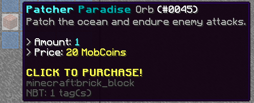
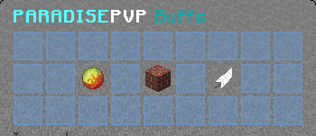
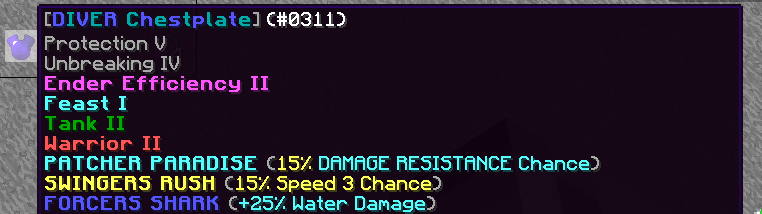

# ParadiseBuffs

Spigot plugin providing configurable ParadisePvP armor buffs purchased with
FactionsKore MobCoins through a custom `/pb` shop.

## Setup

1. Install Java 8+ and a Spigot 1.8.8/1.8.9 server.
2. Install FactionsKore and enable its MobCoin feature.
3. Install PlaceholderAPI and enable FactionsKore's placeholders.
4. Put `ParadiseBuffs-1.0.7.jar` in the server's `plugins` folder.
5. Start the server to generate the configuration and signing key.
6. Edit `plugins/ParadiseBuffs/config.yml` if your FactionsKore placeholder or
   MobCoin take command differs from the defaults.
7. Run `/pb reload`.

Use `/pb` to open the Paradise Buff shop directly.

## Commands

- `/pb` - open the Paradise Buff shop
- `/pb shop` - open the Paradise Buff shop
- `/pb list` - list enabled buff IDs
- `/pb give <buff>` - give yourself one buff orb
- `/pb give <buff> <player> [amount]` - give buff orbs to a player
- `/pb reload` - reload the configuration and integrations

`/paradisebuffs`, `/pbuffs`, and `/buffs` can also be used.

## Permissions

- `paradisebuffs.shop` - open and purchase from the buff shop
- `paradisebuffs.admin` - use list, give, and reload commands

The shop permission is enabled by default. Administrative permission defaults
to server operators.

## Included Buffs

### Forcers Shark

Drag the orb onto the configured armor type. While that armor is equipped,
melee attacks deal configurable bonus damage when the attacker is in water.
Arrows can receive the same bonus when fired in water.

### Patcher Paradise

Drag the orb onto the configured armor type. Placing a block around water opens
an activity window. Taking the required number of entity hits during that
window rolls a configurable chance to grant Resistance or another configured
potion effect.

### Swingers Rush

Drag the feather orb onto the configured armor type. Each successful melee hit
against another player counts toward the configured threshold. Reaching it
rolls a configurable chance to grant Speed III for the configured duration.

## FactionsKore MobCoins

`/pb` opens the Paradise Buffs GUI directly. With `shop.currency: MOBCOINS`,
each click reads `%kore_mobcoins_balance%`, verifies that the player can afford
the offer, checks inventory capacity, executes
`coins take %player% %amount%`, and reads the balance again. The orb is only
granted when the post-withdrawal balance proves that FactionsKore removed at
least the configured price. Missing dependencies, unresolved placeholders,
invalid balances, rejected commands, and unverified withdrawals all fail closed.

The placeholder and take command are configurable under
`integrations.factionskore-mobcoins` for compatibility with different
FactionsKore builds.

## Shop

The default shop is three rows high. Its middle row uses slots 10-16 in this
layout:

```text
[blue pane] [orb] [blue pane] [orb] [blue pane] [orb] [blue pane]
```

Everything is configured under `shop`: its enabled state, title, rows, currency
mode, display names, close behavior, purchase sound, decoration
material/data/name/lore/slots, and every offer's slot, buff, quantity,
price, name, and lore. Shop slots are zero-based.

Bundle purchases are stacked normally (up to the orb material's stack size),
so a multi-orb offer does not require one empty inventory slot per orb.

## Configuration

All player-facing text and gameplay values are in `config.yml`.

You can change:

- Menu title, row count, offer slots, quantities, and prices
- MobCoin balance placeholder and withdrawal command
- Decoration material, data value, name, lore, and slots
- Purchase sound, volume, pitch, and close behavior
- Orb materials, names, lore, and applicable armor
- Shark damage, melee/projectile behavior, and water detection
- Patcher water triggers, hit rules, timing, chance, and potion effect
- Rush hit threshold, activation chance, Speed level, and duration
- Plugin messages, notification toggles, and ParadisePvP colours

The default GUI uses a ParadisePvP oceanic blue, aqua, white, gray, and gold
theme.

## Adding another buff

1. Create a class in the `buffs` package that implements `CustomBuff`.
2. Give it a unique lowercase ID and its own `buffs.<id>` config section.
3. Register it in `ParadiseBuffsPlugin#onEnable`.
4. Use `BuffItemAuthenticator` for signed orb and applied-item markers.

Markers are authenticated with a persistent HMAC key stored at
`plugins/ParadiseBuffs/secret.key`. Back up that file; replacing it
invalidates previously created Paradise Buffs orbs and buffed items.

## Build

The Gradle wrapper requires Java 17+ to run, but the produced plugin targets
Java 8 for Spigot 1.8.8/1.8.9 compatibility.

Run:

```powershell
.\gradlew.bat build
```

The plugin will be created at `build/libs/ParadiseBuffs-1.0.7.jar`.

Maven is also supported with `mvn clean package`.

## Pictures

### Shop and menus

| Buff shop | Buff menu |
| --- | --- |
|  |  |

### Buffs

| Forcers Shark | Patcher Paradise | Swingers Rush |
| --- | --- | --- |
|  |  |  |

### Armor and activation

| Applied armor | Buff activation |
| --- | --- |
|  |  |
